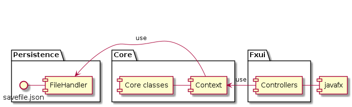

# Release 2: Flashcard App

## Choices Documented

In this release, we made several decisions relating to work habits, workflow, and code quality. We took the following approach:

### Work Habits:

- **Branching for Each Issue**: We adopted a branching strategy where each new feature or bug fix was developed on a separate branch. This allowed for isolated development and testing, ensuring that the `main` branch remained stable at all times. Once the development on a branch was completed and tested, it was merged back into the `main` branch.
  
- **Comprehensive Testing**: We followed a rigorous testing approach where each class had accompanying tests. These tests aimed to cover all methods of the classes, ensuring that every possible code path and scenario was validated. 

### Workflow:
- **Collaborative Work Sessions**: Our team held regular meetings where we collaborated on tasks, reviewed progress, and discussed the architecture and design of the app. This made sure everybody was up to speed with the development of the app.

- **Individual Work & Communication**: When working alone, team members focused on their assigned tasks but remained in constant communication. Any challenges, discoveries, or insights were shared with the team.

### Code Quality:
- **Code Quality Tools**: 
  - **JaCoCo**: Used JaCoCo for code coverage analysis, ensuring that a significant portion of the codebase is tested.
  - **SpotBugs**: Incorporated SpotBugs to detect and prevent bug patterns in Java code.
- **Linting and Formatting**: Used tools to maintain a consistent coding style and catch potential issues early.

## Transition to Multimodular Architecture

### Changes to Project Structure:

#### File Structure:
- Modules have their own root folder, placed in the root directory of the project.
- Each module's file structure mimics that of a single-module project, complete with its own `src/main`, `src/test`, `pom.xml` file, etc.

#### Root `pom.xml` File:
The root `pom.xml` file has undergone several significant changes:
- Packaging was switched to `pom`.
- The `artifactID` was changed to `parent`.
- Introduced module declarations for each submodule.
- Dependencies were relocated to their respective submodules.

#### Module `pom.xml` Files:
Each module is equipped with its own `pom.xml` file, which includes:
- An `artifactID` that defines the module's name.
- A declaration of the parent directory.
- Dependencies not specified in the parent directory.
- Dependencies linked to other submodules.

#### `module-info`:
Every `module-info` in the individual modules incorporates:
- An updated name declaration.
- Specifications on what packages to export to other modules.
- Instructions on which packages to pull from other modules.

## Architecture

The project has transitioned to a three-layered architecture:
- **Core**: A module dedicated to the fundamental program logic.
- **FXUI**: A module responsible for the user interface.
- **Persistence**: A module designed to save and load program data between user sessions.

The inter-module dependencies are structured such that `persistence` is a dependency of `core`, and `core` is a dependency of `fxui`.

