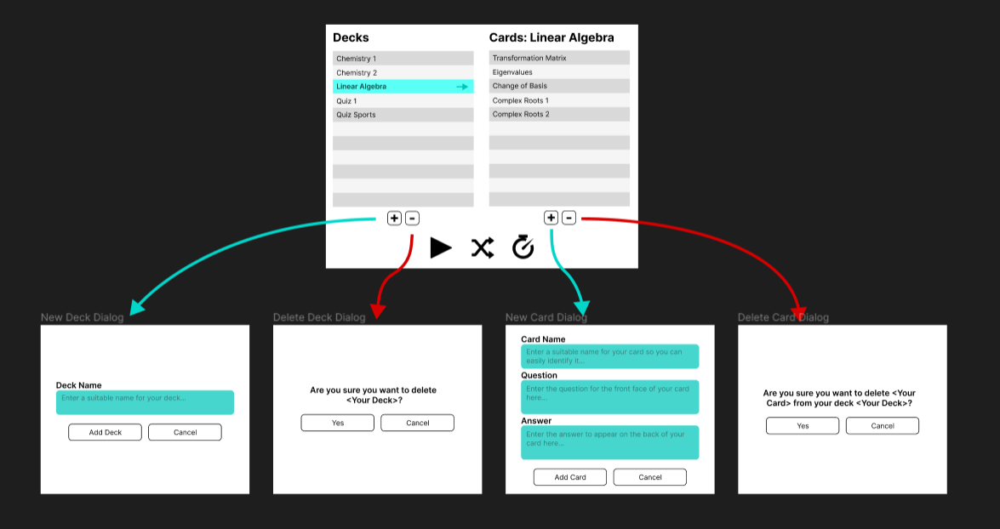
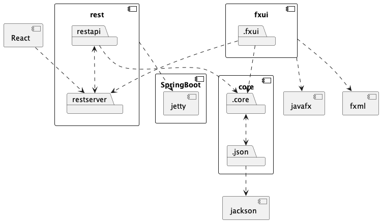
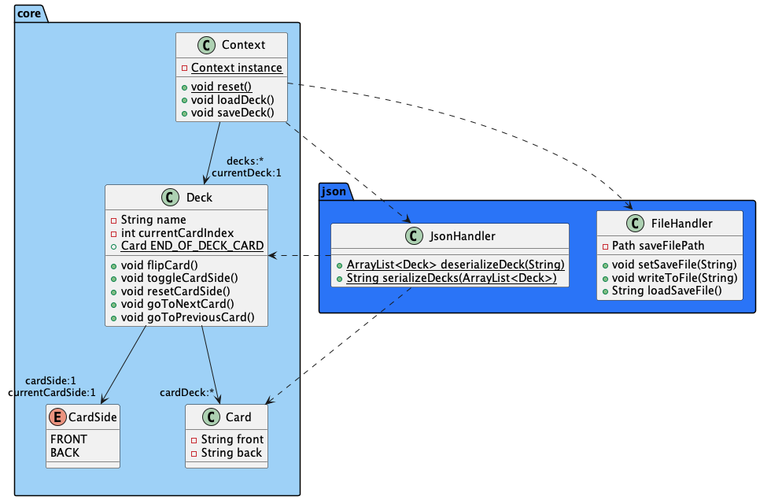
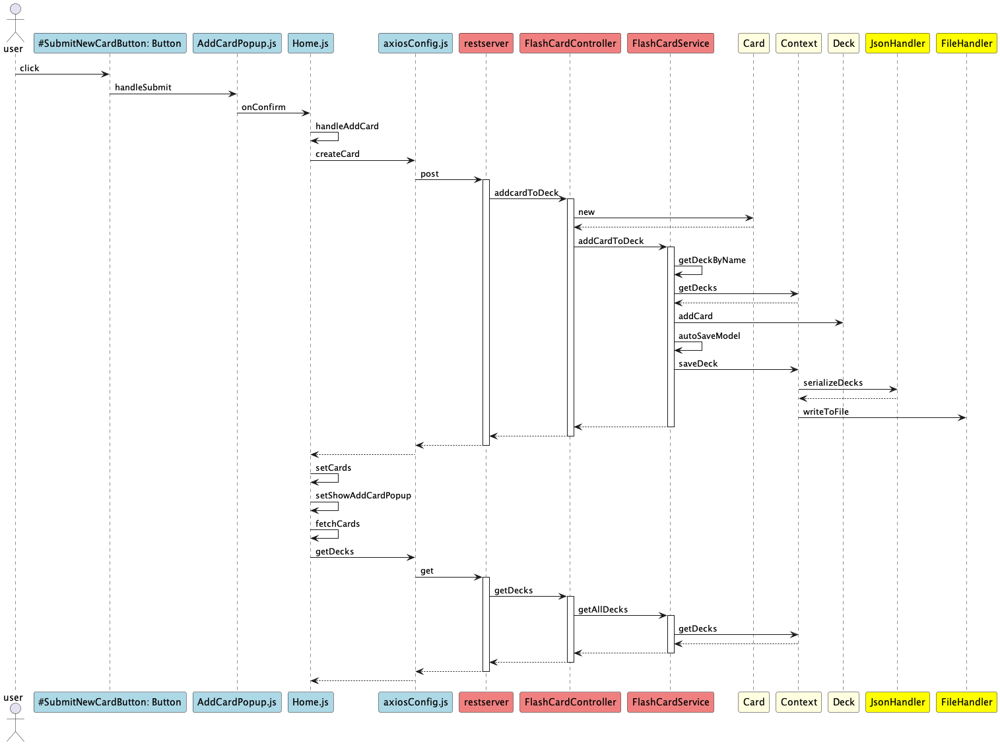

# Release 3: FlashCard App

## Choices Documented

### Work Habits

For the third release, we decided to emphasize certain aspects of our work habits to improve code quality:

- **Pair programming**: We implemented this by having one team member write the code, while another team member observed them. This has been good for code quality, as the observer can review the code as it is being written. Additionally, it has been great for sharing knowlegde, especially with our switch to React where some team members had more experience than others.

- **Merge requests**: As we create new branches for each issue, we have started using merge requests so that the code can be checked by another team member before the branch is merged and issue closed. This ensures the quality of the code pushed to our main development branch.

### Dropped Features

We planned and started work on a quiz-feature, which we ultimately decided to drop as we did not have time to implement them fully. We did complete the logic for the feature which can be found in the following classes in the core-module:

- `src/main/java/core/`
  - `MultipleChoiceQuestion.java`: Represents a multiple-choice question type.
  - `Question.java`: Base class for questions.
  - `Quiz.java`: Represents a collection of questions for a quiz.

and a test class:

- `src/test/java/core/`
  - `QuizTest.java`: Test class for `Quiz`.

These classes are however not used in the finished product for release 3, but could be implemented in a hypothetical future release.

## Changes to Architecture

### UI improvements

For this release, we wanted to improve upon the user interface. Before we began working, we made the following mock-up as a guide:

The changes we wanted include:

- A home scene where you can see a list of all your decks. Selecting a deck will show a list of its contents next to the deck-list.
- Buttons for adding/removing decks or cards, along with corresponding pop-ups

### Transition to React

In this release, we have transitioned from using javaFX for our frontend development to using React, which provides a more modern and dynamic user interface.
For ensuring code quality, we have used Prettier for code formatting.

### Changes in modular structure

We have removed the persistence module and instead moved its contents into the core module. This is because we were having trouble with file management while core and persistence where separate modules, as well as it seeming reduntant. The core module is now structured into two packages:

- `core`, which contains the apps logic
- `json`, which contains what was previously in the persistence module. The class `FileHandler` has also been split into two, so now serialization and deserialization of the `Deck` class to json is taken care of by the class `JsonHandler`.

### REST API

We have implemented a REST API using Spring Boot, which works with both our javaFX client and our React client.

Documentation for our REST-service can be found here: [restAPI docs](restapi.md)

## Diagrams

### Package Diagram

This package diagram shows dependencies between modules.

### Class Diagram

The following class diagram shows class interactions for the internal logic of our app, located in the core module.

### Sequence Diagram

This sequence diagram shows all system calls happening when a user clicks the "Submit"-button to create a new flashcard for a selected deck.

