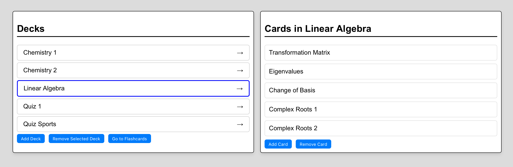
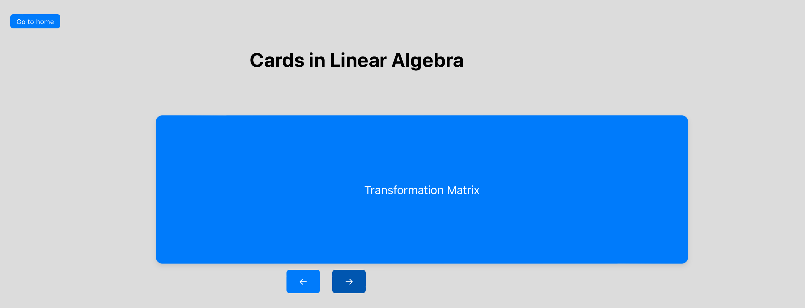

# Flashcardzz

Flashcardzz is an app that lets you create and practice with decks of flashcards.
## User Story: Basic Flashcard Study

## Features

- Pick a deck and practice with it in the card inspector:
  Each card has a frontside and a backside. The cards can be cycled through and flipped with button presses.
- Create and edit decks. New decks, containing user defined cards, can be created. Existing decks can be edited by creating new and deleting old cards. Each deck is saved between sessions.

 _Press a deck on the left side of the screen to show the cards in that deck on the right._

_Pressing the "Go to Flashcards"-button will take you here. Click on the card to flip it and press the arrows to switch cards._

## User Story: Basic Flashcard Study

**As** a student preparing for an upcoming test,  
**I want** to:

- Cycle through a deck of flashcards in a set order,
- Add new cards to the deck when I come across new information,
- Change the name of my deck to reflect its content,
- Save my deck to a file for backup or sharing purposes,

**So that** I can effectively review, organize, and preserve my study materials.

### Acceptance Criteria:

1. **Sequential Navigation:** I can navigate to the next card or the previous card in the deck using clear and intuitive buttons or gestures.
2. **Addition of Cards:** From the main menu or within the deck, I can choose to add a new card, inputting both the front and back text.
3. **Deck Name Modification:** I can change the name of the deck to better describe its contents, with the new name being visibly updated and saved.
4. **Save to File:** I can save my current deck to a file format that retains the structure and content of the deck, allowing me to reload it later or share it with others.
5. **Intuitive UI:** The process to add a card, change the deck name, or save the deck to a file should be simple and intuitive, requiring no more than a few clicks or taps.
